# 사업 전 과정 쉐도잉 — "오후 산뜻 보습 로션" (칸 단위 실습판)

> **이 문서는 무엇인가**
> 플랫폼을 **처음 켠 사람**이 화면을 보고 "이 칸에 뭘 넣지? 어느 버튼을 누르지?"를 헤매지 않도록,
> 제품 하나를 **기획→개발→검증→디자인→마케팅→고객·후기→자금**까지 끌고 가는 전 과정을
> **① 사고의 흐름 → ② 화면에서 입력할 값(칸별) → ③ 누를 버튼 → ④ 나오는 결과** 로 적었습니다.
>
> 숫자는 저장소 예시 데이터로 **실제 실행한 값**입니다. 규제·수치는 1차 스크리닝(출시 전 관할기관 확인 필요).

**보는 법**: 왼쪽 사이드바는 **STEP 0~11 순서**. 위에서 아래로 따라가세요. 각 페이지에서 값을 채우고 저장한 뒤 **새로고침(F5)** 하면 반영됩니다.

**주인공/제품**: 1인 창업자 박수민 · 브랜드 **오후(OHU)** · 제품 **"오후 산뜻 보습 로션"**(50mL, 화장품).
**한 줄**: 냉난방 사무실에서 오후만 되면 당기는 피부를 위한, 끈적이지 않는 지속 보습 로션.

> 표 기호: **[버튼]** = 클릭할 버튼, `칸 이름` = 화면의 입력 칸, → = 결과.

---

## 📸 캡처 넣는 법 (읽고 시작)

이 문서에는 화면을 찍어 넣을 자리가 **`📸 캡처 코드`** 로 표시돼 있습니다. 방법:

1. 표시된 페이지를 열고 **값을 채운 뒤**(대부분 **저장→F5** 한 결과 화면), 그 화면을 캡처합니다.
2. 캡처 블록에 적힌 **파일명 그대로** 저장 → 폴더: **`docs/img/산뜻보습로션/`**
3. 파일을 넣으면 바로 아래 이미지가 자동으로 뜹니다(넣기 전엔 깨진 이미지로 보이는 게 정상).

- **찍는 범위**: 브라우저 전체가 아니라 **본문 영역(제목~결과 표/문장)** 위주로. 사이드바는 첫 캡처(H-1)에 한 번만 나오면 충분합니다.
- **가리기**: 실제 거래처·단가 등 민감정보가 뜨면 가린 뒤 찍으세요(이 시나리오는 예시 데이터라 그대로 OK).
- **체크리스트**: 전체 캡처 목록은 문서 맨 끝 [부록 A · 캡처 체크리스트](#부록-a--캡처-체크리스트)와 `docs/img/산뜻보습로션/README.md`에 있습니다. 하나씩 지워가며 채우면 됩니다.

> 캡처 코드 규칙: `H-#`=홈, `S{STEP}-#`=각 STEP. 예) `S0-2` = STEP 0의 두 번째 캡처.

---

## 시작 화면 — 홈 대시보드

앱을 켜면 **홈**이 2열로 뜹니다. **왼쪽**엔 **📍 오늘(오늘의 퀘스트)** 과 **🔔 오늘 할 일**(밀린 안정성·인증 등), **오른쪽**엔 **📊 현황**(처방·원료·포장재)과 **🏅 마일스톤**. 왼쪽 **STEP 0~11 사이드바**가 이 문서의 목차입니다.

> 📸 **캡처 H-1** · 홈 화면 전체 — **사이드바 + 📍오늘 퀘스트 + 🔔오늘 할 일 + 📊현황 + 🏅마일스톤**이 한 장에. (이 캡처에만 사이드바가 보이면 됩니다) → `img/산뜻보습로션/H-1_홈대시보드.png`

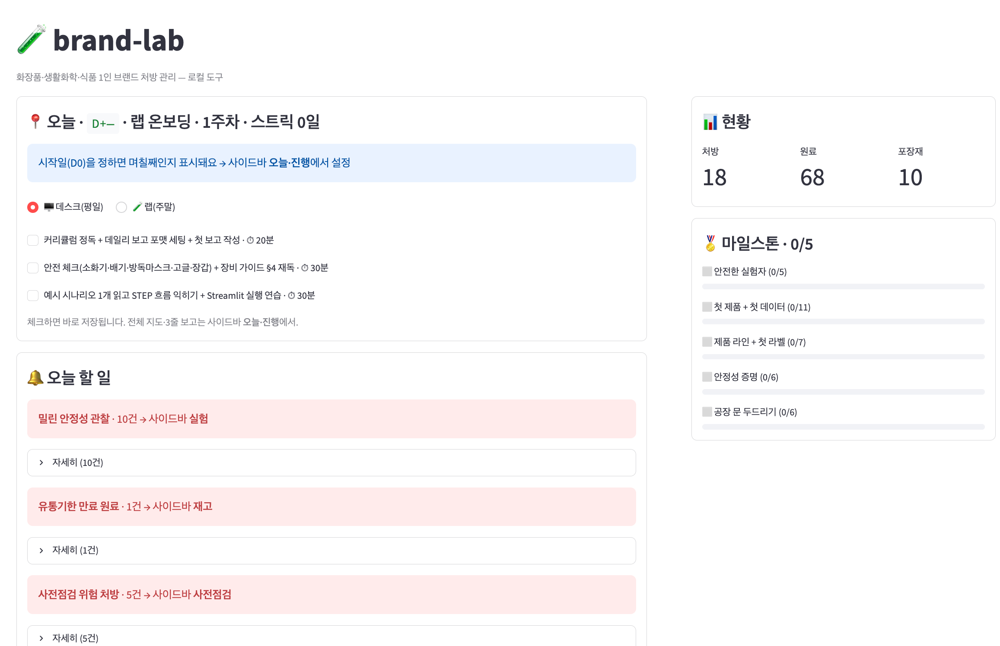

### 이 시나리오를 "매일" 이어가는 법 — `오늘·진행` 🎯

> 🧭 **사고의 흐름:** 이 문서(제품 하나를 기획→출시까지)는 **몇 주에 걸쳐** 진행됩니다. 1인 창업의 최대 적은 실력이 아니라 **흐지부지** — "오늘 뭘 하지?"에서 멈추는 것. 그걸 막는 게 사이드바 맨 위 **시작 → 오늘·진행** 페이지입니다.

- **오늘의 퀘스트**: 커리큘럼(12주 5막)이 **오늘 할 일 1~3개**를 자동으로 짚어줍니다. 평일이면 **🖥️ 데스크(20~40분)**, 주말이면 **🧪 랩(2~4h)** 퀘스트가 기본. **체크하면 바로 저장**.
- **완료 기반 진행**: "며칠째니 며칠째 걸 해라"가 아니라 **다음 미완료 퀘스트**를 짚습니다. **결석해도 진도가 안 밀려요.**
- **흐지부지 방지**: 스트릭(🔥 연속일), **연속 2회 결석 시 "10분 법칙" 복귀 경고**, **마일스톤 🏅**(막 완료 시 획득) 진행바.
- **3줄 보고**: 오늘 한 것 / 막힌 것 / **내일 할 것(다음 퀘스트 자동 프리필)** — 딱 3줄로 끊기지 않게.

> 📸 **캡처 H-2** · `오늘·진행` 페이지 — 상단 **경과(D+)·현재 막·스트릭** + 탭(전체 지도/마일스톤/3줄 보고). '전체 지도'에서 막별 퀘스트 체크리스트가 보이게. → `img/산뜻보습로션/H-2_오늘진행.png`

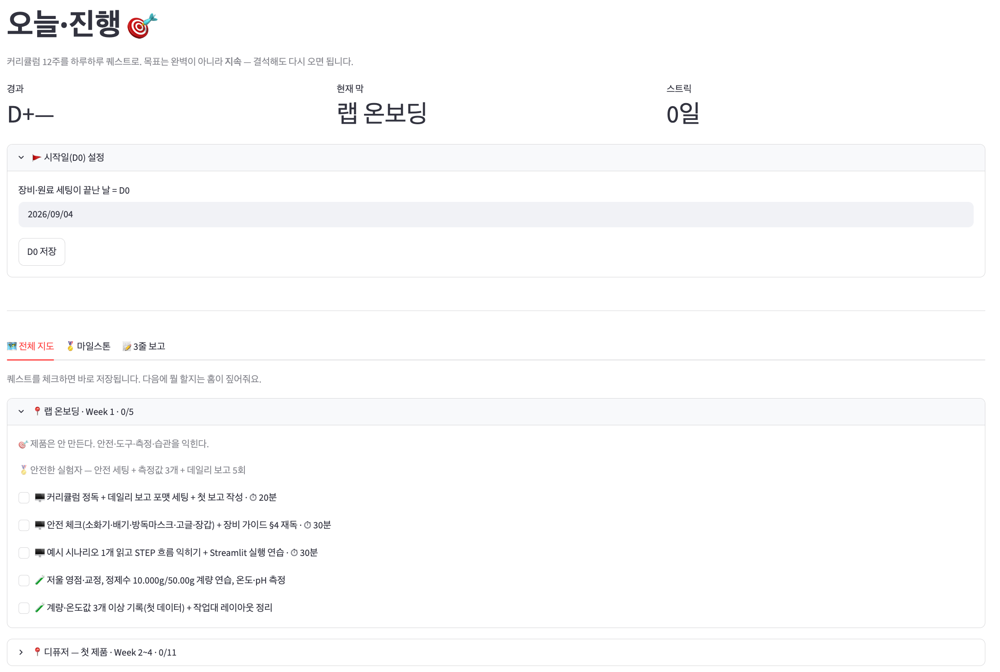

> 💡 **결정:** 이 시나리오의 STEP들은 **오늘·진행의 퀘스트로 하루치씩** 소화합니다. 문서는 "무엇을/왜", 오늘·진행은 "**오늘 어디까지**". 완벽이 아니라 **지속**이 목표 — 빠진 날은 10분 법칙으로 다시 앉으면 됩니다.

---

# STEP 0 · 기획 — 누구의 무슨 문제를 풀지부터

## 0-1. `페르소나 · JTBD` 페이지 🧑

> 🧭 **사고의 흐름:** "수분크림 만들까?"가 아니라 **"누가, 언제, 뭘 불편해하나"** 를 먼저 적는다. 페인을 점수로 매겨 **1순위 하나**를 고른다.

**① 페르소나 표에 한 줄 입력** (표에서 행을 채웁니다):

| 칸 | 넣을 값(예시) | 왜 |
|---|---|---|
| `id` | `dry-office-30s` | 영문·하이픈 고유 이름표(다른 표가 이걸로 연결) |
| `name` | `건조한 사무직 30대` | 사람이 읽는 이름 |
| `one_line` | `냉난방 사무실에서 하루 종일 당김을 느끼는 30대 직장인` | 한 줄 정의(포지셔닝 '타깃'으로 그대로 감) |
| `context` | `실내 근무 8시간, 냉난방 상시, 점심 후 화장 들뜸` | 상황 |
| `jobs(쉼표)` | `바쁜 아침 빠른 흡수, 메이크업 위 덧바름` | 고객이 시키는 일(JTBD) |
| `current_solution` | `대형 브랜드 수분크림` | 지금 쓰는 대안 |
| `dissatisfaction` | `끈적이고 흡수가 느려 화장이 밀림` | 그 대안의 불만(문제의 씨앗) |
| `priority` | `5` | 타깃 우선순위(1~5) |

**② 페인 표에 두 줄 입력** (`persona_id`로 위 페르소나에 연결):

| persona_id | desc | severity | frequency |
|---|---|---|---|
| `dry-office-30s` | `오후만 되면 볼이 당기고 각질이 인다` | `5` | `4` |
| `dry-office-30s` | `수분크림이 끈적여 덧바르기 싫다` | `3` | `4` |

> 📸 **캡처 S0-1** · 저장 **전** — 페르소나 1줄 + 페인 2줄을 **채워 넣은 입력 표**(어떤 칸에 뭘 넣는지 보이게). → `img/산뜻보습로션/S0-1_페르소나입력.png`

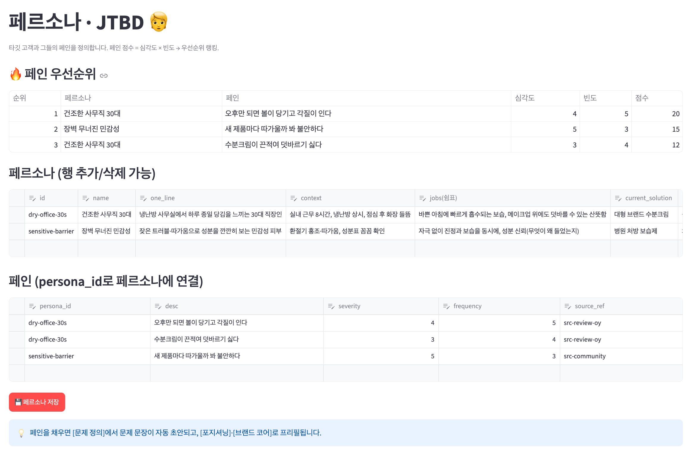

▶️ **[💾 페르소나 저장]** → 새로고침 → 상단 **🔥 페인 우선순위** 표:
- 오후 당김 **점수 20**(5×4), 끈적임 12 → **1순위 = 오후 당김**

> 📸 **캡처 S0-2** · 저장·F5 **후** — 상단 **🔥 페인 우선순위** 표(오후 당김 20이 1위로 정렬된 결과). → `img/산뜻보습로션/S0-2_페인우선순위.png`

> 💡 **결정:** 감이 아니라 **점수 20**으로 "이것부터 푼다"가 정해진다. severity·frequency는 1~5로 솔직하게. (근거가 있으면 `source_ref`에 다음 페이지의 출처 id를 적는다.)

## 0-2. `시장 · 경쟁 조사` 페이지 🔎

> 🧭 **사고의 흐름:** 내 감을 뒷받침할 근거를 쌓는다. **출처(sources)를 먼저** 만들고, 시장·경쟁이 그 출처를 가리키게 한다.

**① 출처(sources) 표:**

| id | title | kind | reliability |
|---|---|---|---|
| `src-review-oy` | `올리브영 수분크림 리뷰 300건 분석` | `리뷰` | `3` |

**② 경쟁(competitors) 표** — 여기 `gaps`(빈틈)가 나중에 포지셔닝 비교표로 자동 승격:

| name | price_band | claims(쉼표) | gaps(쉼표) | source_ref |
|---|---|---|---|---|
| `대형 A사 수분크림` | `2~3만원` | `72시간 보습` | `끈적임, 흡수 느림, 강한 향` | `src-review-oy` |

▶️ **[💾 조사 저장]** → `source_ref`가 없는 출처를 가리키면 **경고**가 뜹니다(오타 방지).

> 📸 **캡처 S0-3** · 경쟁(competitors) 표 + `gaps`(끈적임·흡수 느림·강한 향)까지 채운 상태. 저장 시 경고가 뜨면 그것도 함께. → `img/산뜻보습로션/S0-3_경쟁조사.png`

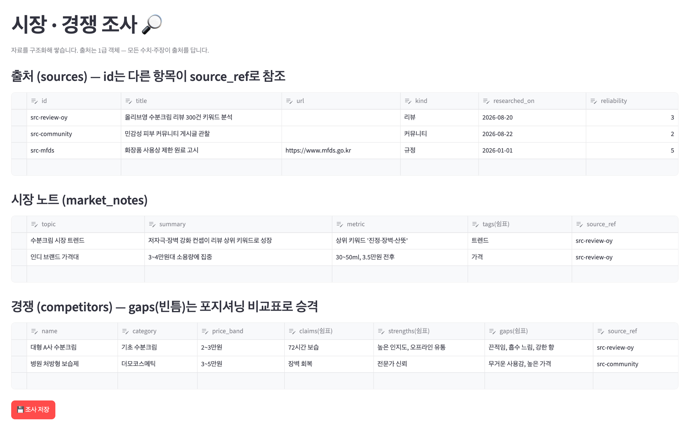

> 💡 **결정:** 경쟁은 **현상("A사=끈적임")** 으로 적는다 — 실명 비방 리스크를 피하고 빈틈을 겨눈다.

## 0-3. `문제 정의` 페이지 🎯

> 🧭 **사고의 흐름:** 페르소나+페인+대안 불만을 **한 문장**으로 합친다. 이게 개발이 조준할 과녁.

▶️ 먼저 **[✨ 문제 문장 자동 초안]** 클릭 → `문제 문장` 칸이 자동으로 채워짐:
> "냉난방 사무실 30대는 '오후 당김' 문제를 겪는다. 지금은 대형 브랜드 수분크림을 쓰지만 **끈적이고 흡수가 느려 화장이 밀린다.**"

이어서 칸을 다듬습니다:

| 칸 | 넣을 값 |
|---|---|
| `대상 페르소나` (선택) | `dry-office-30s` |
| `핵심 페인` | `오후 당김 + 끈적임(덧바름 불가)` |
| `문제 문장` | (위 자동 초안 그대로/수정) |
| `가설 — 이걸 풀면 ~` | `다축 보습 + 가벼운 유상으로 '산뜻한 지속 보습'을 만들면 덧바름 불만이 해결된다` |
| `성공 기준(지표)` | `사용 4주 후 '오후 당김' 관능점수 개선 + 덧바름 만족 후기` |

▶️ **[💾 문제 정의 저장]** → 아래 **하류 프리필 미리보기**에 포지셔닝·브랜드코어로 넘어갈 값이 표시됨.

> 📸 **캡처 S0-4** · **[✨ 자동 초안]**으로 채워진 `문제 문장` + 하단 **하류 프리필 미리보기**(포지셔닝·브랜드코어로 넘어갈 값)가 함께 보이게. → `img/산뜻보습로션/S0-4_문제정의.png`

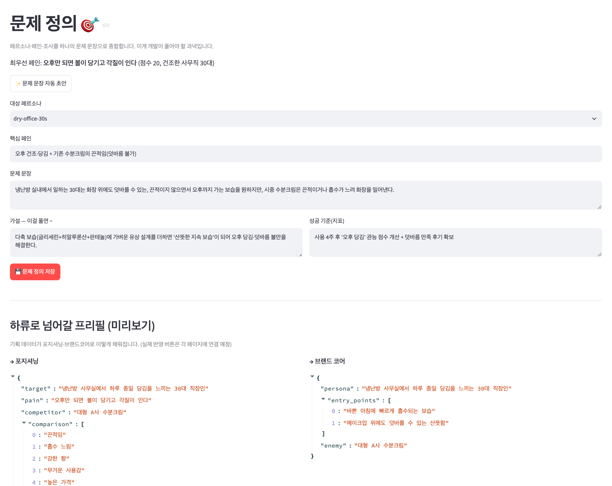

> 💡 **결정:** 진짜 문제는 "보습 부족"이 아니라 **"끈적여서 덧바를 수 없음"**. → 해결책이 "더 강한 보습"이 아니라 **"산뜻한 지속 보습"** 으로 갈린다. 방향이 여기서 결정된다.

## 0-4. `포지셔닝` 페이지 🧭

> 🧭 **사고의 흐름:** 기획을 문장 하나로 응축한다. 앞에서 채운 걸 **버튼 하나로 끌어오고**, 나만의 무기(신물질·수치)만 더한다.

▶️ 먼저 **[기획에서 프리필 (빈 칸만 채움)]** → `타겟`·`페인 포인트`·`경쟁/기존 방식`·비교표가 자동으로 채워짐.

나머지 칸만 손으로:

| 칸 | 넣을 값 | 왜 |
|---|---|---|
| `근거 기준 제품` | `daily-lotion v2` | 수치 근거를 이 제품에서 뽑음 |
| `우리만의 신물질/신공정` | `다축 보습(글리세린+히알루론산+판테놀)` | 우리만의 방식 |
| `수치적 이익/성능 (핵심!)` | `오후 4시 당김 개선·끈적임 없음` | **검증가능한 숫자가 뾰족함** |
| `카테고리 (작은 시장)` | `사무실용 산뜻 보습 로션` | 작은 시장 1등 |

→ 화면 하단에 **포지셔닝 문장**이 자동 조립됩니다:
> **우리는 냉난방 사무실 30대에게, A사 수분크림이 못 푼 '오후 당김'을, 다축 보습으로 '오후 4시 당김 개선·끈적임 없음'으로 해결하는 유일한 '사무실용 산뜻 보습 로션'이다.**

> 📸 **캡처 S0-5** · 하단에 **자동 조립된 포지셔닝 문장**(위 굵은 문장)이 보이게. 비교표까지 프리필됐으면 함께. → `img/산뜻보습로션/S0-5_포지셔닝문장.png`

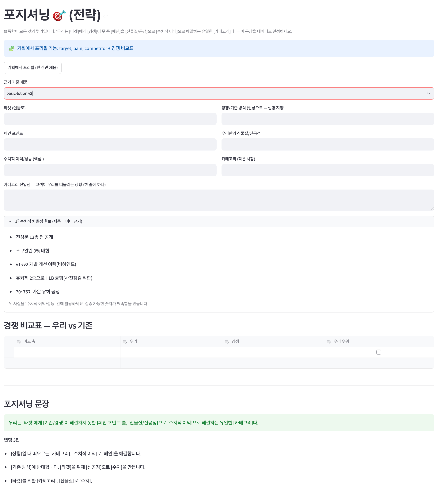

▶️ **[💾 포지셔닝 저장]**

> 💡 **결정:** 이 한 문장이 **원료·라벨·디자인·마케팅 전부의 기준**. 흔들리면 이 페이지로 돌아온다.

## 0-5. `브랜드 코어` 페이지 🎯

▶️ **[🧩 기획에서 프리필]** → `② 타깃`·`③ 적`·`① 진입점`이 자동 입력. 나머지만:

| 칸 | 넣을 값 |
|---|---|
| `브랜드명` | `오후(OHU)` |
| `④ 약속 — 한 문장` | `산뜻하게, 오후까지` |
| `⑥ 톤 형용사(쉼표)` | `담백한, 정직한` |
| `⑧ 금지어(쉼표)` | `완벽, 최고, 미백` |
| `⑦ 메인 컬러(HEX)` | `EAE0D5` (따뜻한 베이지) |
| `⑦ 서브 컬러` | `6B705C` (차분한 세이지) |
| `⑦ 포인트 컬러` | `C97C5D` (오후 햇살 테라코타) |
| `⑦ 제형 무드` | `matte, soft-touch` |
| `⑩ 차별점이 사는 층` | `처방 설계 — 같은 원료, 다른 사용감·컨셉 조합` (체크) |
| `⑩ 한 줄 요약` | `산뜻 보습을 글리세린 증량이 아니라 '보습+진정 다축'으로 푼다` |

> ⑦ 컬러는 `#` 없이 `EAE0D5`처럼 넣어도 되고, `beige` 같은 이름색도 됩니다. 이 값이 아래 무드보드의 팔레트가 됩니다.

### ⑩ 차별점 — 우리의 문제해결 '비법'은 어느 층에 있나

> 🧭 **사고의 흐름:** 화장품 원료는 대부분 **공개된 공용 팔레트**라 누구나 같은 걸 산다. **신소재 개발은 원료 대기업 몫**이고, 1인 창업의 차별점은 신소재가 아니라 **아래 네 층의 조합**에서 나온다. 이 항목에서 우리 비법이 어느 층에 사는지 **체크(1~2개 집중)** 하면, 브랜드 자산 텍스트 ⑩에 담겨 **모든 마케팅 프롬프트로 이어진다.**

| 차별화 층 | 뜻 | 산뜻보습로션은? |
|---|---|---|
| **문제 정의** | 희귀 원료보다 *좁은 타깃의 안 풀린 페인*을 정확히 | 냉난방 사무실 오후 당김(STEP 0에서 정조준) |
| **처방 설계** | 같은 원료로 *다른 사용감·컨셉* | ✅ **글리세린 증량 대신 판테놀로 '진정' 축 추가** |
| **브랜드·서사·신뢰** | 비율로 복제 안 되는 유일한 층(왜·투명성·근거) | ⑤ 근거(관능·후기)로 증명 |
| **니치·실행·고객 친밀도** | 큰 브랜드가 무시하는 마이크로 세그먼트를 살뜰히 | 1인이라 더 빠르고 가깝게 |

> ⚠️ **함정:** "이 히어로 성분 하나면 팔린다"(마법의 원료)는 착각. 신소재는 **남도 곧 사서 오래 못 가는 '양념'**이지 해자가 아니다. 팔리는 제품은 **정확한 문제 + 일관된 처방 경험 + 믿음 가는 브랜드**의 합작.

▶️ **[💾 코어 시트 저장]**

> 📸 **캡처 S0-6** · 브랜드 코어 시트를 채운 화면(브랜드명·약속·톤·금지어·⑦컬러·⑩차별점이 보이게). → `img/산뜻보습로션/S0-6_브랜드코어.png`

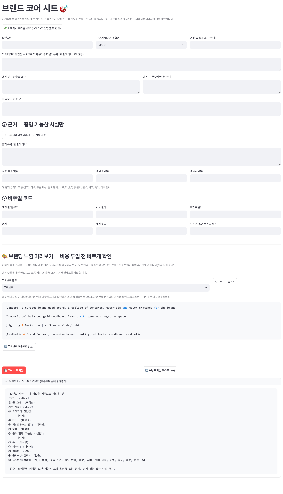

> 💡 **결정:** 금지어를 미리 등록하면, 나중에 마케팅 문구 검사에서 **자동으로 걸러진다.** ⑩ 차별점은 **"신소재 없이 무엇으로 이길지"** 를 매번 저장 때 스스로 점검하게 해준다.

## 0-6. 브랜딩 느낌 미리보기 — 비용 쓰기 전, 프롬프트로 먼저 본다 🎨

> 🧭 **사고의 흐름:** 컨셉을 "말"로 잠그기 전에 **느낌**을 눈으로 확인하고 싶다. 브랜딩은 제품·마케팅에 다 녹아드니까. 단, **이미지 생성은 외부 도구**에서 — 플랫폼은 여기까지 **팔레트 확인 + 무드보드 프롬프트**만 만든다(비용·API 0).

브랜드 코어 페이지 하단 **🎨 브랜딩 느낌 미리보기** 섹션에서:

**ⓐ 팔레트 즉석 확인** — 위에서 넣은 ⑦ 메인/서브/포인트 HEX가 **색 블록 + 팔레트 띠**로 바로 뜹니다. 외부 도구조차 안 거치고 **색 궁합**을 그 자리에서 봅니다.

> 📸 **캡처 S0-7** · 메인/서브/포인트 색 블록 + 하단 팔레트 띠가 보이게. → `img/산뜻보습로션/S0-7_컬러스와치.png`

**ⓑ 무드보드 프롬프트 생성** — `무드보드 종류`(무드보드 / 컬러 스토리 / 패키지 무드 / 키비주얼) 고르고 ▶️ **[무드보드 프롬프트]** → 브랜드명·컬러·톤·한줄소개가 반영된 **영어 6블록 프롬프트**가 나옵니다. **제품 실물이 없으니** '제품 변경 금지' 가드 없이 **자유 컨셉 생성** 모드(예: `[Concept] a curated brand mood board … for 오후 — 산뜻하게, 오후까지` / `[Lighting] palette #EAE0D5, #6B705C, #C97C5D`).

이 프롬프트를 복사해 **외부 이미지 도구(나노바나나 등)** 에 붙여넣으면 브랜딩 느낌 시안이 나옵니다.

> 📸 **캡처 S0-8** · `무드보드 종류` 선택 + 생성된 **무드보드 프롬프트 코드블록**이 보이게. → `img/산뜻보습로션/S0-8_무드보드프롬프트.png`

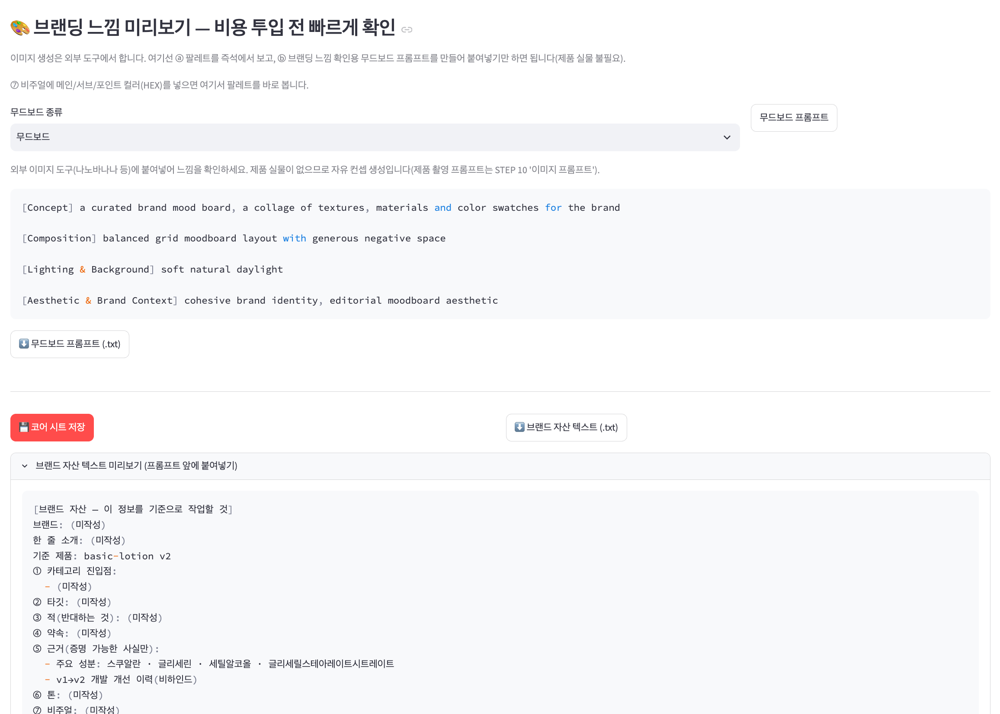

> 💡 **결정:** 느낌은 **싸니까 많이** 탐색한다(무드보드·스와치는 공짜). 단, **확정은 뒤로** 미룬다 — 타깃 반응·OEM 샘플로 제품 진실이 확인된 **뒤에** 잠근다. 여기서 만든 팔레트·톤은 그대로 STEP 9(디자인 브리프)·STEP 10(이미지 프롬프트)로 이어져, **제품과 마케팅에 같은 얼굴**로 녹아든다.
>
> ⚠️ **제품 촬영 프롬프트와 구분:** 여기 무드보드는 "느낌 탐색"(제품 없음·자유 생성). 실제 **제품 사진**은 STEP 10 `이미지 프롬프트`에서 — 그건 실촬영 실물을 참조로 쓰고 '제품 변경 금지' 가드가 붙는다.

---

# STEP 1 · 규제 — 무슨 법이고 얼마 드나

## `규제판정` 페이지 ⚖️

| 칸 | 넣을 값 |
|---|---|
| `용도` | `body` |
| `제형` | `liquid` |
| 기능(멀티) | `moisturize` |
| `예상 SKU 수` | `5` |
| `검토 기간(년)` | `5` |

→ 결과: **화장품(화장품법)** · 등록 1회 · SKU 추가비 0원 · 적합성 **OK**.

> 📸 **캡처 S1-1** · 판정 결과 카드 — **화장품(화장품법) / 등록 1회 / 적합 OK**가 보이게. → `img/산뜻보습로션/S1-1_규제판정.png`

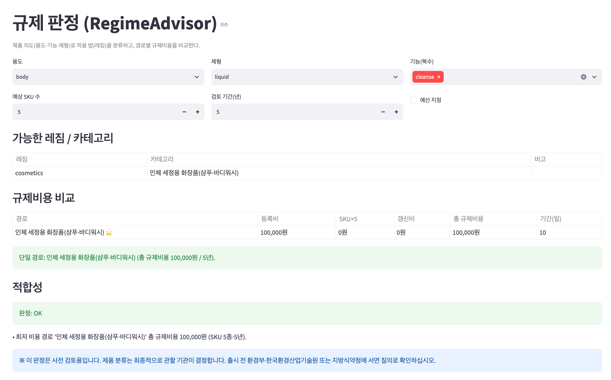

> 💡 **결정:** 기능에 `sanitize`(살균)를 넣으면 **살생물제**로 바뀌어 승인 1년. `moisturize`만. "치료·아토피" 같은 말도 붙이지 않는다(의약품化 방지).

---

# STEP 2 · 원료·재료 — 원료 고르고, 용기 정하고, 재고 확인

## 2-1. `원료` 페이지 📦

> 🧭 **사고의 흐름:** "산뜻한 지속 보습"을 어떻게? **글리세린 증량(끈적임↑)이 아니라 다른 축(판테놀) 추가.**

**새 원료 등록**(예: 판테놀) — 필수 4칸만 넣고 나머지는 자동:

| 칸 | 넣을 값 |
|---|---|
| `id (고유 슬러그)` | `panthenol` |
| `원료명(한글)` | `판테놀(프로비타민B5)` |
| `INCI 표준명` | `Panthenol` |
| `분류` | `보습제` |

▶️ 저장 후, 위쪽 **🔎 PubChem 자동채움**에서 `원료 선택`=`panthenol` → **[PubChem 조회]** → CAS·밀도가 조회됨 → **[ingredients.yaml에 채우기(저장)]**.

> 📸 **캡처 S2-1** · **🔎 PubChem 조회 결과**(panthenol의 CAS·밀도가 자동으로 뜬 화면). → `img/산뜻보습로션/S2-1_원료_PubChem.png`

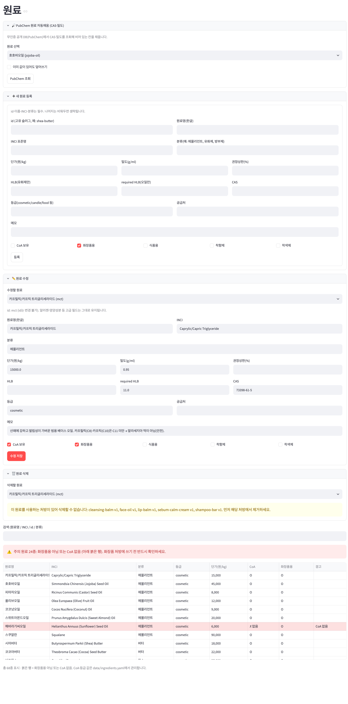

> 💡 **결정:** `CAS`·`밀도`는 손으로 안 찾는다(자동). **붉은 행(CoA 없음/화장품용 아님)** 원료는 그대로 쓰지 않는다.

## 2-2. `원료 도감` 페이지 📚 — 원료가 처음이라 뭔지 모를 때

> 🧭 **사고의 흐름:** 원료를 고르려면 **그게 뭔지·왜 넣는지·몇 %·어느 상(수상/유상)에 언제** 넣는지를 알아야 한다. 도감은 계산용 데이터(단가·HLB·상한)에 **사람이 읽는 설명**을 얹어 한 화면에서 배우는 곳. 이 시나리오 처방(산뜻보습로션)에 들어가는 **14종이 모두 채워져** 있다.

▶️ `원료 도감` 페이지 → **검색/분류**로 원료 선택(예: `글리세린`) → 한 화면에 두 블록이 뜬다:

| 블록 | 내용 |
|---|---|
| **왼쪽 · 백과** | 🧭 이게 뭔가 · 🎯 왜 넣나 · ✋ 사용감 · ⚗️ 사용법(대표 %·투입 상) · 🤝 궁합 · ⚠️ 주의 · 🔁 대체재 · 🌱 초보 팁 |
| **오른쪽 · 계산용 데이터** | 원료 마스터와 **자동 연동**(단가·밀도·HLB·상한·CAS·CoA·화장품등급) |

예를 들어 이 처방을 도감으로 읽으면 **왜 이렇게 짰는지**가 보인다:
- **글리세린**은 산뜻하려면 5% 안팎(많으면 끈적) → 그래서 증량 대신 **판테놀(진정 축)** 로 보습을 더했다.
- **세틸알코올**은 이름은 알코올이지만 **말리지 않는 지방 알코올**(점도·바디용).
- **페녹시에탄올**은 물 든 제형의 **필수 보존제**, 40℃ 아래 냉각 후 투입.
- **라벤더오일**은 '천연이라 안심'이 아니라 **리날룰 등 알러젠 표기 대상** → 리브온은 보수적으로.

> 📸 **캡처 S2-2** · 도감에서 원료(예: 글리세린) 선택 시 **왼쪽 백과 + 오른쪽 계산용 데이터**가 함께 뜬 화면. → `img/산뜻보습로션/S2-2_원료도감.png`

> ⚠️ **검증 필요 표시:** 사용 %·주의·규제성 서술은 화면에 **⚠️ 검증 필요**로 뜬다 — 일반 통용값을 예시로 담은 것이니, **배합 전** 공급처 CoA/기술자료(TDS)·STEP 1 규제판정으로 확인한다.
>
> 💡 **결정:** 새 원료가 궁금하면 **도감부터** 본다. 페이지 하단 **"아직 백과 없는 원료" 목록**에서 뭘 채우면 좋을지 알 수 있고, `data/ingredient_codex.yaml`에 `- id: <원료id>` 블록만 넣으면 화면에 바로 나타난다.

## 2-3. `포장재` 페이지 📦

> 🧭 **사고의 흐름:** 처방만큼 중요한 게 **용기**다. 특히 **MOQ(최소주문수량)** 가 초도 자본을 좌우한다 — 미리 등록해 두면 STEP 7 원가·장바구니에서 사장 재고가 자동 계산된다.

**포장재 등록**(50㎖ 유리 자):

| 칸 | 넣을 값 |
|---|---|
| `id` | `jar-50ml` |
| `이름` | `50ml 유리 자` |
| `형태` | `jar` |
| `용량(ml)` | `50` |
| `재질` | `유리` |
| `개당 단가(원)` | `800` |
| `MOQ(최소주문수량)` | `3000` |

▶️ **[등록]**

> 📸 **캡처 S2-3** · 포장재 등록 폼(jar-50ml · 단가 800 · MOQ 3000). → `img/산뜻보습로션/S2-3_포장재등록.png`

> 💡 **결정:** MOQ **3,000개**가 함정. 초도 1,000개만 만들어도 **2,000개(160만원)가 사장 재고**로 묶인다(STEP 7에서 자동 경고). 용기는 **MOQ 낮은 곳**을 먼저 찾는 게 초도 자본을 아끼는 길.

## 2-4. `재고` 페이지 📊

> 🧭 **사고의 흐름:** 뭘 사야 할지 정하려면 **지금 뭐가 있는지**부터. 유통기한(개봉 후 사용기한 포함)을 만료/임박/신선으로 본다.

▶️ `재고` 페이지 → 보유 원료가 상태별로 정렬(예시 데이터 기준):

| 원료 | 상태 |
|---|---|
| 페녹시에탄올 | 🔴 만료(개봉 후 기한 지남) |
| 시어버터 | 🟡 임박(16일) |
| 글리세린 · 호호바오일 | 🟢 신선 |

> 📸 **캡처 S2-4** · 재고 표 — 만료/임박/신선이 색으로 구분된 화면. → `img/산뜻보습로션/S2-4_재고상태.png`

> 💡 **결정:** **만료(페녹시에탄올)는 폐기·재구매** 대상. 부족분 실제 구매는 STEP 7 `장바구니`가 이 재고를 빼고 계산한다. 재고는 `data/inventory.yaml`(선택) — 없으면 전량 구매로 처리.

---

# STEP 3 · 처방·사전점검 — 비커에 붓기 전 실패 거르기

## 3-1. `처방` 페이지 🧪 (새 처방 만들 때)

> 예시엔 `daily-lotion`이 이미 있습니다. 새로 만들 땐 아래 폼을 채웁니다.

| 칸 | 넣을 값 |
|---|---|
| `제품명` | `오후 산뜻 보습 로션` |
| `slug (폴더명)` | `daily-lotion` |
| `버전` | `1` |
| `레짐` | `cosmetics` |
| `제품형태` | `leave_on`(안 씻어냄) |
| `기준 배치(g)` | `200` |
| `충전 부피 ml` | `50` |

▶️ **[처방 생성]** → 생성된 처방에 상(A수상/B유상/C냉각)과 원료 %를 채웁니다(합계 100).
- A(수상): 정제수·글리세린5·히알루론산0.1·잔탄검0.3
- B(유상): 유화제5·세틸2·호호바6·스쿠알란4·시어3
- C(냉각): 페녹시에탄올1·헥산다이올2·토코페롤0.5·라벤더0.3

> 📸 **캡처 S3-1** · 처방의 **상(A/B/C)·원료·% 표**(합계 100)가 보이게. → `img/산뜻보습로션/S3-1_처방구성.png`

## 3-2. `사전점검` 페이지 🔍

▶️ `처방 선택`=`daily-lotion v1` → **5가지가 한 화면에** 자동 판정됩니다:

| 점검 | 결과 | 의미 |
|---|---|---|
| **HLB 유화** | 적합 (공급 10.0 / 요구 9.88) | 유화 안 깨짐 |
| **배합한도** | 페녹시에탄올 **도달**(한도 정확히) | 더 못 올림 |
| **원료 상용성(충돌)** | 충돌 없음 | 나이아신+비타민C·양이온↔음이온 등 규칙 통과 |
| **보존 시스템** | 양호(페녹시에탄올 + 1,2-헥산다이올) | 물 로션 필수 방어 확보 |
| **제형·유수분** | **유상 13.3% → 로션(가벼움)** · 휴멕7.1 / 에몰7 / 옥클1.5 / 유화4 | 산뜻 로션답게 유상 낮춤 |

> 📸 **캡처 S3-2** · 5가지(HLB 10.0/9.88 · 페녹시에탄올 도달 · 상용성 없음 · 보존 양호 · 유상 13.3% 로션)가 한 화면에. → `img/산뜻보습로션/S3-2_사전점검.png`

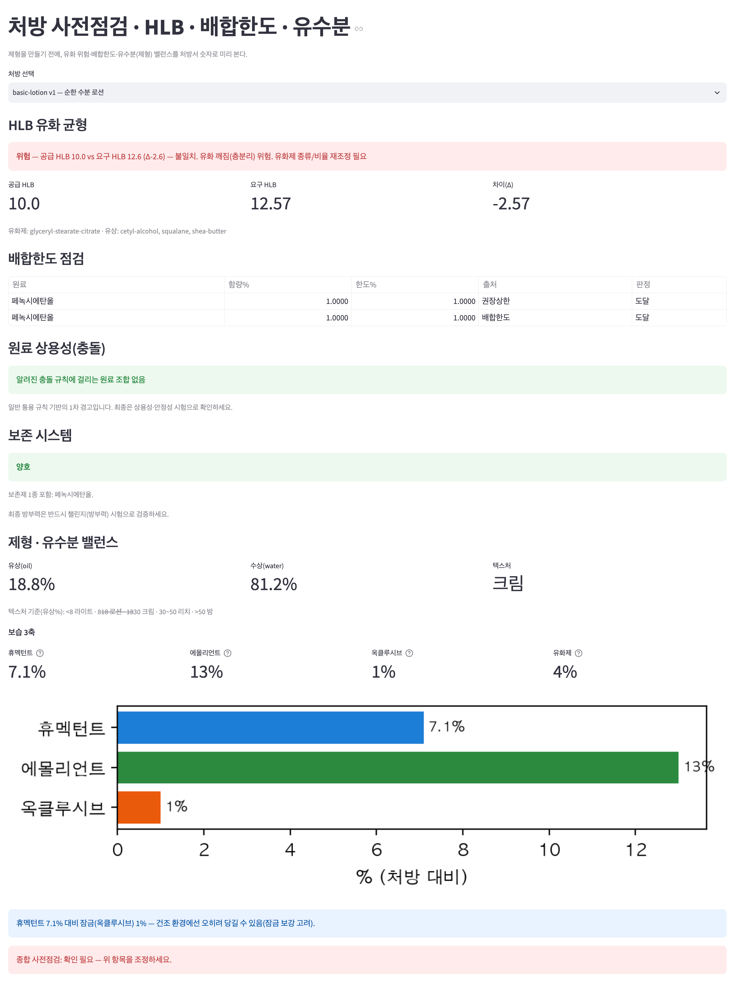

> 💡 **결정:** 한 화면에서 **유화(HLB)·한도·충돌·보존·유수분**을 비커 전에 확인. 특히 **유상 13.3% = '로션'** 으로 잡았다 — 유상이 20%대로 오르면 분석상 '크림 경계'가 되어 산뜻함이 깨진다. 그래서 "산뜻 로션"은 유상을 **가볍게(≈13%)**, 대신 보습은 수상의 휴멕턴트(글리세린·HA·판테놀)로 채운다. 페녹시에탄올은 한도라 손대면 위법 → 그대로.

---

# STEP 4 · 제조·기록 — 만든 걸 숫자로

## `배치 기록` 페이지 🧾

▶️ **[새 기록지 생성]** 탭 → `처방 선택`=`daily-lotion v1`, `목표 배치 크기(g)`=`100` → **[experiments/batches/ 에 저장]**.

▶️ 제조 후 **[✏️ 실측 입력]** 탭에서 **화면으로 바로** 기입(파일 안 열어도 됨): `수율 yield_g`=`92.5`, `pH`=`5.2`, `관찰`=`냉각 후 약간 묽음` → **[💾 실측 저장]**. 원료별 실측(actual_g)도 표에서 채울 수 있습니다.

▶️ **[기록 요약]** 탭 → **수율 92.5% · pH 5.2(✅ 정상)** 표.

> 📸 **캡처 S4-1** · **[기록 요약]** 탭의 수율·pH 표(수율 92.5% · pH 5.2 ✅). → `img/산뜻보습로션/S4-1_배치요약.png`

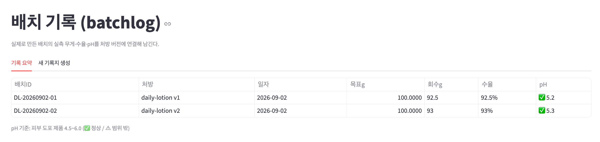

> 💡 **결정:** "묽음" 관찰이 **다음 버전 개선의 근거**. 감이 아니라 기록으로 고친다.

---

# STEP 5 · 실험·검증 — 벤치 실험부터 MOQ 게이트까지

## 5-1. 실험 순서 — 초보자 로드맵 🗺️

> 🧭 **사고의 흐름:** "실험"은 무작정 이것저것 섞어보는 게 아니다. **방향을 찾고 → 확정하고 → 안 무너지는지 검증하고 → 사람에게 물어보는** 4단계 루프다. MOQ(본생산) 돈을 쓰기 전에 이 순서를 밟는다.

| 순서 | 무엇을 | 어디서 | 무엇을 얻나 | 언제 |
|---|---|---|---|---|
| ① 방향 탐색 | 소량 여러 배합을 만들어 비교 | `실험` · **DOE 분석** (5-4) | "오일↑ = 보습↑·백탁↑" 같은 **인과 방향** | 처방 초기·개선 전 |
| ② 버전 확정 | 개선안을 이전 버전과 비교(원가 포함) | `버전비교` (5-2) | 신규 원료·**개당 원가 변화** | 개선 1건 반영할 때 |
| ③ 변질 검증 | 시제품을 온도·시간에 노출 | `실험` · **안정성 시험** (5-5) | 분리·변색·pH 변화 여부 | **MOQ 전 필수** |
| ④ 수용도 | 타깃 몇 명에게 나눠주고 점수 | `관능·패널` (5-3) | "산뜻함 4.5" 같은 **근거** | **MOQ 전 게이트** |

> 아래 5-2~5-5는 **도구별 사용법**입니다. 실제 진행은 이 로드맵 순서(①→④)를 따르세요. ③·④는 둘 다 **MOQ 직전 관문**이라 병행해도 됩니다.

**벤치(집·공방) 실험 3원칙 — 초보자**
1. **소량으로.** 한 배합당 30~50g면 충분. 실패해도 원료 손실이 적고 여러 개를 동시에 볼 수 있다.
2. **한 번에 한 축만 바꾸거나(비교), 체계적으로 여러 축을(DOE).** 아무거나 동시에 바꾸면 뭐가 원인인지 모른다.
3. **바로 기록.** 감(感)은 사흘이면 사라진다. 관찰은 그 자리에서 숫자·메모로 남긴다(배치기록 STEP4 · 아래 DOE/안정성 표).

---

### 새 원료 도입·개선 설계법 — 스스로 v3를 만들 때 (초보자 필독)

> 🧭 **사고의 흐름:** 위 로드맵이 "어떤 순서로 실험하나"라면, 여기는 "**무엇을 어떻게 바꿔 새 처방을 짜나**"다. 처음 써보는 원료를 넣거나, 기능을 발전시킬 때의 방법론.

**Ⓐ 처음 써보는 원료 도입 5수칙**
1. **도감에서 먼저 읽는다.** STEP 2-2 `원료 도감`에서 그 원료의 **대표 %·투입 상(수상/유상/냉각)·주의·궁합**을 확인. (시작값을 감으로 찍지 않는다)
2. **낮은 %부터.** 도감 범위의 **하단**에서 시작(예: "2~5%"면 2%).
3. **한 번에 하나만 도입.** 새 원료 2~3개를 한꺼번에 쌓지 않는다 — 문제 생기면 원인을 못 찾는다.
4. **패치 테스트.** 자극 가능 성분은 팔 안쪽에 소량 발라 반응을 본다.
5. **알던 베이스에 얹는다.** 검증된 v2 위에 그 하나만 바꿔 변화를 본다.

**Ⓑ 개선의 두 방법 — 비율 조정 vs 원료 스왑**

| 방법 | 뜻 | 예 (산뜻보습로션) |
|---|---|---|
| **① 비율 조정** | 같은 원료, % 만 변경 | 유상 13%→11%로 더 산뜻, 부족한 보습은 수상 휴멕턴트로 |
| **② 원료 스왑** | 같은 역할, 다른 원료로 교체 | pH조절제 시트릭→**락틱애씨드**(보습 겸) · 점증제 잔탄검→**스클레로튬검**(실 늘어짐↓) · 글리세린 일부→**베타인**(끈적임↓) |

> ⚠️ **스왑은 공짜가 아니다.** 같은 pH조절제라도 시트릭→락틱으로 바꾸면 pH만이 아니라 **사용감·안정성·저pH 보존제 궁합·자극**이 함께 흔들린다. 그래서 스왑 후엔 **`사전점검`(3-2) → `안정성`(5-5) → `관능`(5-3)** 을 다시 돌린다. 특히 **유화제 교체 = HLB·안정성 재확인**, **보존제 교체 = 방부 스펙트럼 재확인**.

**Ⓒ 시작 비율 골격 — 감이 아니라 상(phase)에서**

| 상 | 대략 비중 | 무엇이 들어가나 |
|---|---|---|
| **수상 (A)** | ~65–80% | 정제수 + 휴멕턴트(글리세린·판테놀 등) + 수용성 활성 |
| **유상 (B)** | ~10–20% | 오일 + 버터 + 지방알코올 + **유화제**(HLB 매칭) |
| **냉각첨가 (C)** | ~3–5% | 보존제 + 향 + 열에 약한 활성 |

> 합계 100은 **물(수상)로 맞춘다**(마지막에 나머지 채움). **유상이 20%대로 오르면 '크림 경계'** 가 되어 산뜻함이 깨지므로, 산뜻 로션은 유상을 낮게(≈13%) 두고 보습은 수상으로 채운다(3-2 참고).

**Ⓓ 발전 방향 예시 (각각 한 축씩, 두 버전으로 비교)**
- **더 산뜻하게** — 유상 13%→11% + 점증제 잔탄→스클레로튬(매끈)
- **진정 기능 강화** — 수상에 마데카소사이드(0.1%) 또는 베타글루칸 소량 추가 → '보습+진정' 축 강화
- **장벽 기능** — 세라마이드NP + 콜레스테롤 조합(난이도 높음·용해 주의)

> 💡 **결정:** 개선은 **가설 1개 → 변수 1개만 바꾼 v3 → 사전점검 → 소량 제조 → 안정성·관능 → 버전비교(원가) → 채택/폐기** 의 반복이다. 새 원료의 **안전·함량·기능성 표방(주름·미백)·산 상한**은 도감 `⚠️ 검증 필요`대로 배합·표시 전 확인한다.

---

## 5-2. `버전비교` 페이지 🔀

개선안 v2를 만든다: 잔탄검 0.3→0.4(묽음↓), 히알루론산 0.1→0.15, **판테놀 1.0 신규**(USP).

▶️ `처방(슬러그)`=`daily-lotion`, `이전 버전`=`1`, `비교 버전`=`2`, `원가 비교 수량`=`1000`:

| | 결과 |
|---|---|
| 신규 원료 | **판테놀** |
| 개당 원료비 변화 | **+23.5원** |

> 📸 **캡처 S5-1** · v1→v2 비교 결과 — **신규 원료 판테놀 · 개당 +23.5원**이 보이게. → `img/산뜻보습로션/S5-1_버전비교.png`

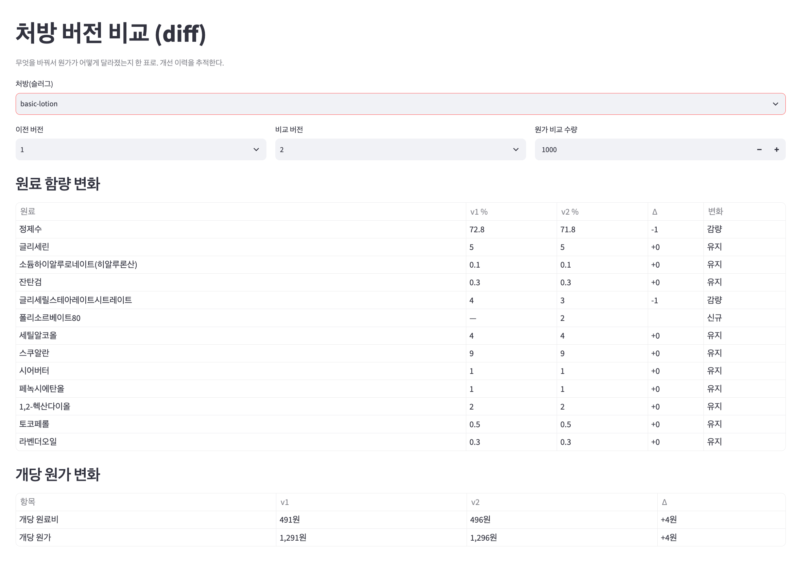

> 💡 **결정:** USP를 더했는데 개당 **+23원**뿐(22,000원 제품 기준 무시 수준) → **원가 리스크 없이 차별화**. v2 확정.
> ⚠️ "보습 좋아짐"(효능)은 집에서 증명 불가 → 판매 전 **외부 랩 시험**.

## 5-3. `관능·패널 평가` 페이지 🧪 — MOQ 쓰기 전, 시제품을 사람에게 물어본다

> 🧭 **사고의 흐름:** v2가 **숫자상** 좋아졌다고 끝이 아니다. **본생산(MOQ 3,000개) 돈을 쓰기 전에**, 시제품을 타깃 몇 명에게 나눠주고 "진짜 산뜻한가"를 정량으로 확인한다. DOE(요인 최적화)·안정성(변질)과 다른, **수용도 게이트**.

**① 새 평가 생성** 탭: `평가 ID`=`daily-lotion-v2-panel1`, `시제품`=`daily-lotion v2`, 항목=`촉촉함·산뜻함_비끈적·향·발림성·재구매의사`, 목표선=`촉촉함 4.0 / 산뜻함 4.0 / 재구매의사 4.0` → **[평가 생성]**.

**② 응답 입력** 탭: 시제품을 나눠준 사람들의 점수를 표에 입력(평가자·세그먼트[타깃/비타깃]·항목 점수·코멘트). 예시 데이터는 타깃 4명 + 비타깃 1명, 5점 척도.

> 📸 **캡처 S5-2** · **응답 입력** 표 — 평가자별 항목 점수·세그먼트·코멘트가 채워진 화면. → `img/산뜻보습로션/S5-2_관능응답입력.png`

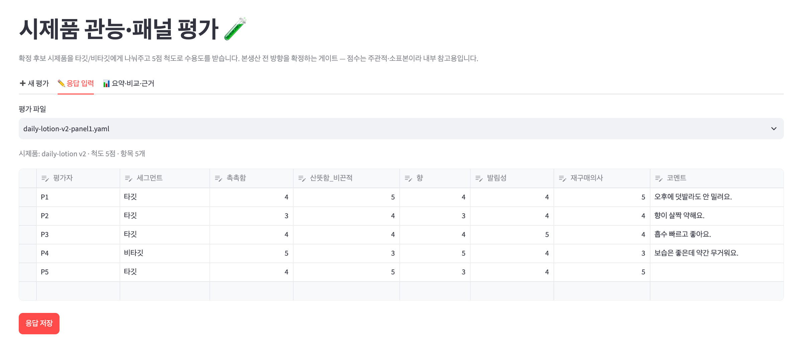

**③ 요약·비교·근거** 탭: 세그먼트 `타깃`으로 보면 항목별 평균·상위2박스·목표 충족(✅/⚠️)이 나온다.

| 항목 | 타깃 평균 | 판정 |
|---|---|---|
| 산뜻함_비끈적 | 4.5 | ✅ (핵심 USP 검증) |
| 재구매의사 | 4.5 | ✅ |
| 촉촉함 | 3.75 | ⚠️ 목표 4.0 미달 → **약점** |
| 향 | 3.5 | (목표 없음) |

→ **약점 배지**와 함께 **개선 힌트** "촉촉함 3.8 < 목표 4.0 → 다음 버전에서 개선 검토"가 뜬다. 하단 **⭐ 근거 승격**에서 강한 항목(산뜻함·재구매의사)과 대표 코멘트("오후에 덧발라도 안 밀려요")를 **근거 카드로** 만들어 **브랜드 코어 ⑤**에 붙인다.

> 📸 **캡처 S5-3** · **요약** — 항목별 평균·상위2박스·충족(✅/⚠️) 표 + 약점 배지·개선 힌트, (아래) 근거 승격. → `img/산뜻보습로션/S5-3_관능요약근거.png`

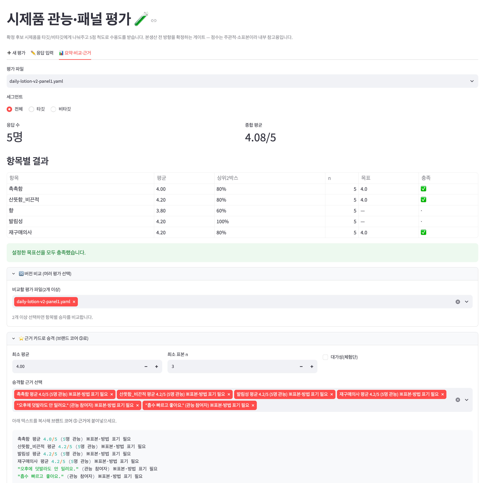

> 💡 **결정:** 핵심 USP인 **"산뜻함"은 타깃 4.5로 검증**(→ 포지셔닝 근거로 승격). 대신 **"촉촉함"이 목표 미달** → v3에서 보습축을 손댈지 저울질. **감이 아니라 사람들의 숫자로** MOQ 결정을 내린다.
> ⚠️ 관능은 **소표본·주관적** → 내부 참고용이며 효능 표방 아님. 마케팅에 쓸 땐 **표본·방법 표기 + 문구검사(STEP 6) 통과**, 대가성 체험단은 **뒷광고 표기**. 홈 대시보드가 **응답 미입력·약점 시제품**을 알림.

## 5-4. `실험` 페이지 · **DOE 분석** 탭 🧬 — 어떤 변수가 무엇을 바꾸나

> 🧭 **사고의 흐름:** 유화제·오일·점증제를 **하나씩** 바꾸면 조합이 폭발하고, 두 변수가 **같이** 작용하는 효과(교호작용)를 놓친다. DOE(실험계획법)는 **여러 변수를 체계적으로 동시에** 돌려, 최소 실험으로 "무엇을 올리면 무엇이 오르내리는지"를 뽑아낸다.

**2^k 완전요인이 뭔가:** 변수(인자) k개를 각각 **낮음(low)·높음(high) 2수준**으로 조합 → **2^k개 배합(런)**. 인자 3개면 2³ = **8개** 배합. 데일리 로션 예시는 이미 `experiments/doe/daily-lotion-screening.yaml`에 들어 있다.

| 인자(바꾸는 것) | low → high |
|---|---|
| `emulsifier` 유화제 % | 3 → 6 |
| `oil` 오일상 총 % | 10 → 20 |
| `thickener` 점증제 % | 0.2 → 0.5 |

평가항목(1~5점): `점도 · 발림성 · 흡수력 · 유화안정성 · 보습감 · 백탁`

**따라 하기**
1. ▶️ **➕ 새 DOE 설계 생성**: `설계 이름`, `연결 처방`=`daily-lotion`, **인자·수준 표**(위 3행), `평가항목`(쉼표로: `점도, 발림성, 흡수력, 유화안정성, 보습감, 백탁`), `파일명` → **[DOE 생성]**. → 점수가 **빈칸**인 8런 골격이 만들어진다.
2. **벤치에서 8개를 실제로 만든다.** 각 런의 factor_values대로(예: 런1 = 유화제 low·오일 low·점증제 low) 30~50g씩, **같은 온도·같은 방법**으로.
3. **채점.** 각 시료를 만져보고/발라보고 1~5점. (`유화안정성` = 하루 뒤 분리 안 됨 / `백탁` = 바를 때 하얗게 뜸 → **낮을수록 좋음**).
4. ▶️ **✏️ 점수 입력/수정** 표에 점수를 넣고 **[점수 저장]**(회색 factor_values는 읽기전용 · .bak 자동 백업).
5. **주효과·해석 자동.** 각 인자를 low→high로 올릴 때 항목이 평균 얼마나 변하는지(+/−)가 표·문장으로 나온다.
6. ▶️ **🎯 추천 조합**: 항목별 **목표**(max/min)·**가중치**를 정하면 desirability로 **최고 관측 런**과 **다음에 시도할 조합**을 추천. (`백탁`은 낮을수록 좋으니 **목표를 min으로 바꿔** 주세요 — 기본값은 max로 잡힐 수 있음.)

**예시 데이터가 말해주는 것(주효과 = high 평균 − low 평균):**

| 올리면(low→high) | 좋아지는 것 | 나빠지는 것 |
|---|---|---|
| `thickener` 점증제 | 점도 **+2.0** | 발림성 **−1.0** |
| `oil` 오일 | 보습감 **+2.0** | 흡수력 **−2.0** · 백탁 **+1.0** |
| `emulsifier` 유화제 | 유화안정성 **+2.0** | 백탁 **+1.0** |

> 📸 **캡처 S5-4** · **DOE 분석** 탭 — 주효과 표 + 🎯 추천 조합(다음 실험 후보)이 보이게. → `img/산뜻보습로션/S5-4_DOE주효과.png`

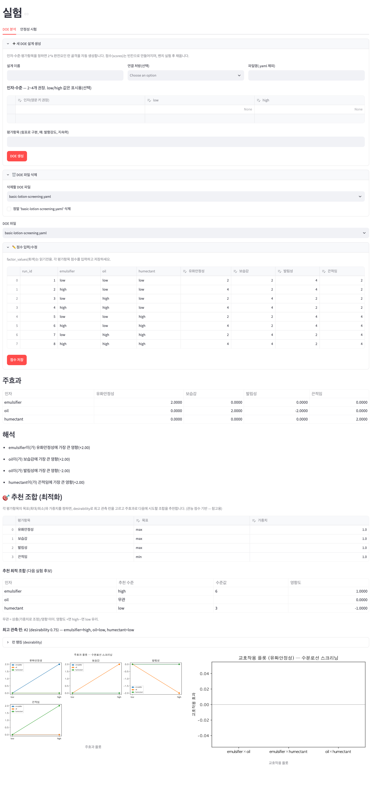

> 💡 **결정:** "산뜻"이 목표면 **백탁은 낮게, 흡수·발림은 높게**. 표를 보면 **오일을 올리면 보습은 늘지만 흡수↓·백탁↑** → 그래서 오일(유상)을 **낮추고**, 부족한 보습은 **수상 휴멕턴트(글리세린·HA·판테놀)** 로 채운다. **유화제**는 유화안정성에 꼭 필요하나 백탁을 유발하니 **깨지지 않는 최소**로. → 이것이 STEP3에서 유상을 13%로 낮춘 **실험적 근거**다.
> ⚠️ 관능 점수 기반 스크리닝이라 **방향 탐색용(참고)**. 확정 전 대표 조합은 재현 실험으로 확인.

## 5-5. `실험` 페이지 · **안정성 시험** 탭 🌡️ — 시간이 지나도 안 무너지나

> 🧭 **사고의 흐름:** 만든 **직후** 멀쩡한 건 당연하다. 문제는 **몇 주·몇 달 뒤**. 에멀전 로션은 **분리(크리밍)·변색·이취(산패)·pH 변화·점도 변화**가 생길 수 있다. MOQ 3,000개를 찍기 전에 "유통기한 동안 버티나"를 확인한다.

**가속 시험이 뭔가:** 상온에서 몇 달 걸릴 변질을 **높은 온도(45℃)** 로 몇 주에 압축해서 본다. 조건은 4가지:

| 조건 | 뜻 | 왜 |
|---|---|---|
| `45C` | 45℃ 가속 | **핵심** — 상온 유통 변질을 빠르게 |
| `RT` | 상온 대조 | 45C와 비교할 기준선 |
| `freeze_thaw` | 냉·해동 반복 | 겨울 배송·냉장 보관 견디나 |
| `light` | 광 노출 | 변색·향 변질 |

관찰 시점은 **시작일 기준 1·2·4·8주**가 자동 계산된다.

**따라 하기**
1. ▶️ **➕ 새 안정성 시료 등록**: `시료 ID`(예 `DL-001`), `연결 처방`=`daily-lotion v2`, `조건`=`45C`, `시작일`(=제조일), `파일명` → **[등록]**. → 1/2/4/8주 예정일 자동. (예시엔 `DL-001-45C`가 이미 있다.)
   - **권장:** 같은 배치를 최소 **45C + RT 두 조건** 동시에. 로션이면 freeze_thaw도.
2. **예정일에 시료를 꺼내 관찰** → ▶️ **✏️ 관찰 기록 입력/수정**: 시료 파일 선택 → 행 추가 → `date`(필수)·`외관`·`분리`·`색`·`냄새`·`경도`·`판정`·`비고` → **[관찰 저장]**(.bak 백업).
3. ⏰ **밀린 관찰**: 예정일이 지났는데 미기록이면 **빨간 경고**. 그 시점 데이터는 **놓치면 복구 불가**(그 주의 상태를 되돌려볼 수 없다).
4. **조건별 현황** 격자: 시료 × 주차에 **✓ 완료 / ✗ 지연(+며칠) / · 예정**.
5. 이 알림은 **홈 대시보드 🔔 오늘 할 일**(STEP0)에도 함께 뜬다.

**판정 가이드(초보):** 아래 중 하나라도 나타나면 **✗(불안정)** → 처방·보존·포장을 재검토.
- **분리**: 오일 층·크리밍(위로 뜸)
- **변색 / 이취**: 산패·오염 신호
- **pH ±0.5 이상** 변화 또는 **현저한 점도 변화**

**45℃ 8주 통과 = 상온 유통 안정성 1차 확보(참고)**. 에멀전 로션은 특히 **분리·pH**를 본다.

> 📸 **캡처 S5-5** · **안정성 시험** 탭 — ⏰ 밀린 관찰 + 조건별 현황(주차 격자 ✓/✗/·)이 보이게. → `img/산뜻보습로션/S5-5_안정성현황.png`

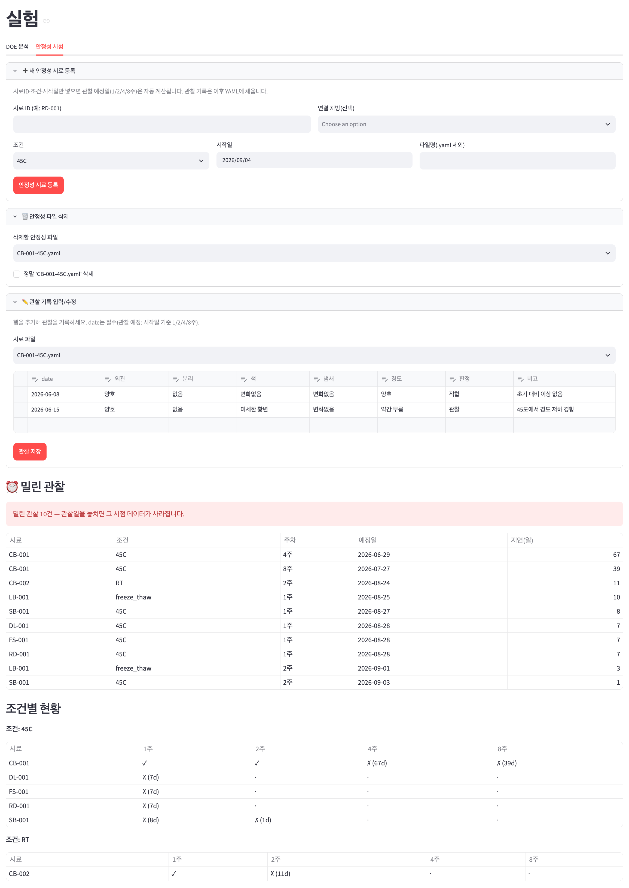

> 💡 **결정:** 45C 8주에서 **분리·pH 이상 없음**이면 v2로 MOQ 진행. 이상이 보이면 **유화제·점증제(안정성)·보존·차광 포장**을 손본 v3로. 관능(5-3)과 함께 **MOQ 직전 2대 관문**.
> ⚠️ 가속 시험은 **참고 예측**이지 유통기한 보증이 아니다. 최종 유통기한·표시는 출시 전 **공인 시험·관할기관 기준**으로 확인.

---

# STEP 6 · 표시·검토 — 라벨과 광고

## `라벨` 페이지 🏷️ / `문구검사` 페이지 📝

- `라벨`: `처방 선택`=daily-lotion v2 → 전성분 표시(안)·표시의무·**알러젠(라벤더의 리날룰·리모넨·제라니올 표기 대상)**.
- `문구검사`: 상세페이지 초안을 붙여넣기 → "미백·완벽" 같은 위험 표현이 **색으로** 표시 + 대체안.

> 📸 **캡처 S6-1** · `라벨` 페이지 — **전성분 표시(안) + 알러젠(리날룰·리모넨·제라니올)** 표기 대상이 보이게. → `img/산뜻보습로션/S6-1_라벨_전성분.png`

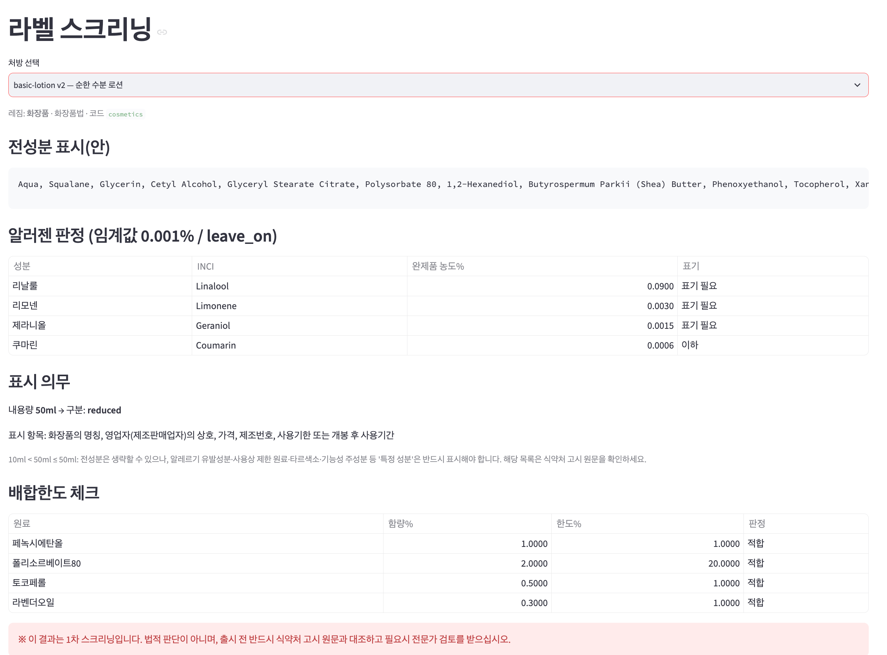

> 📸 **캡처 S6-2** · `문구검사` 페이지 — 위험 표현이 **색으로 표시**되고 대체안이 뜬 화면(브랜드 금지어 "완벽" 포함). → `img/산뜻보습로션/S6-2_문구검사.png`

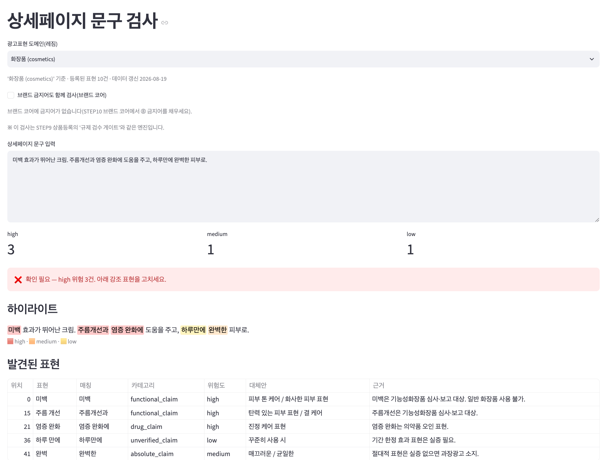

> 💡 **결정:** 브랜드 금지어("완벽")를 카피에서 뺀다. **게이트 통과한 문구만** 사용.

---

# STEP 7 · 원가·구매·자금 — 남는지, 살 수 있는지, 버티는지

## 7-1. `원가` 페이지 💰

| 칸 | 넣을 값 |
|---|---|
| `처방 선택` | `daily-lotion v2` |
| `주문 수량` | `1000` |
| `판매가 (부가세 포함)` | `22000` |

→ 결과:

| 지표 | 값 |
|---|---|
| 개당 원가 | **1,130원** |
| 개당 공헌이익 | **9,064원** |
| 마진(실매출) | **45.3%** |
| 손익분기 | **302개** |
| 총 선투입 자본 | **2,729,990원** |

> 📸 **캡처 S7-1** · 원가 결과 지표 — **개당 원가 1,130원 · 마진 45.3% · 손익분기 302개**가 보이게. → `img/산뜻보습로션/S7-1_원가.png`

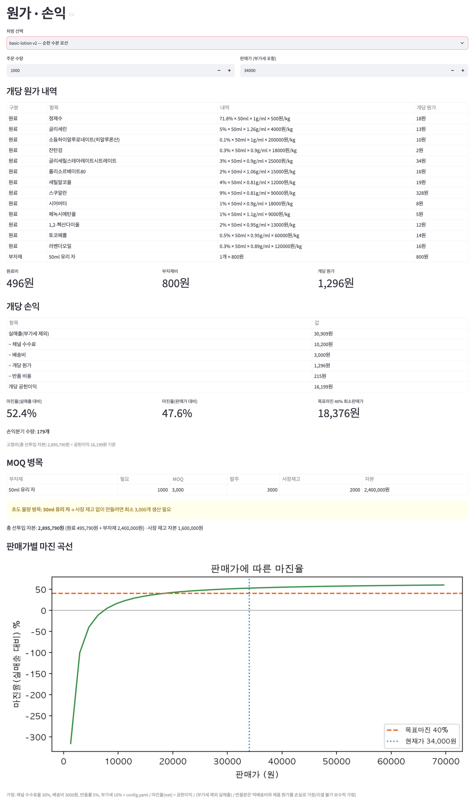

> 💡 **결정:** 손익분기 302개 → 초도 1,000개면 회수 가능. 판매가 22,000원 유지.

## 7-2. `장바구니` 페이지 🛒

▶️ `처방 선택`=daily-lotion v2, `구매 기준`=`생산 수량(개)`, `생산 수량`=`1000`:
→ **총 예상 구매액 2,874,542원** = 원료 474,542 + **포장 2,400,000**.

> 📸 **캡처 S7-2** · 장바구니 합계 — **총 2,874,542원(원료 vs 포장 내역)**이 보이게. 포장 비중이 큰 게 드러나도록. → `img/산뜻보습로션/S7-2_장바구니.png`

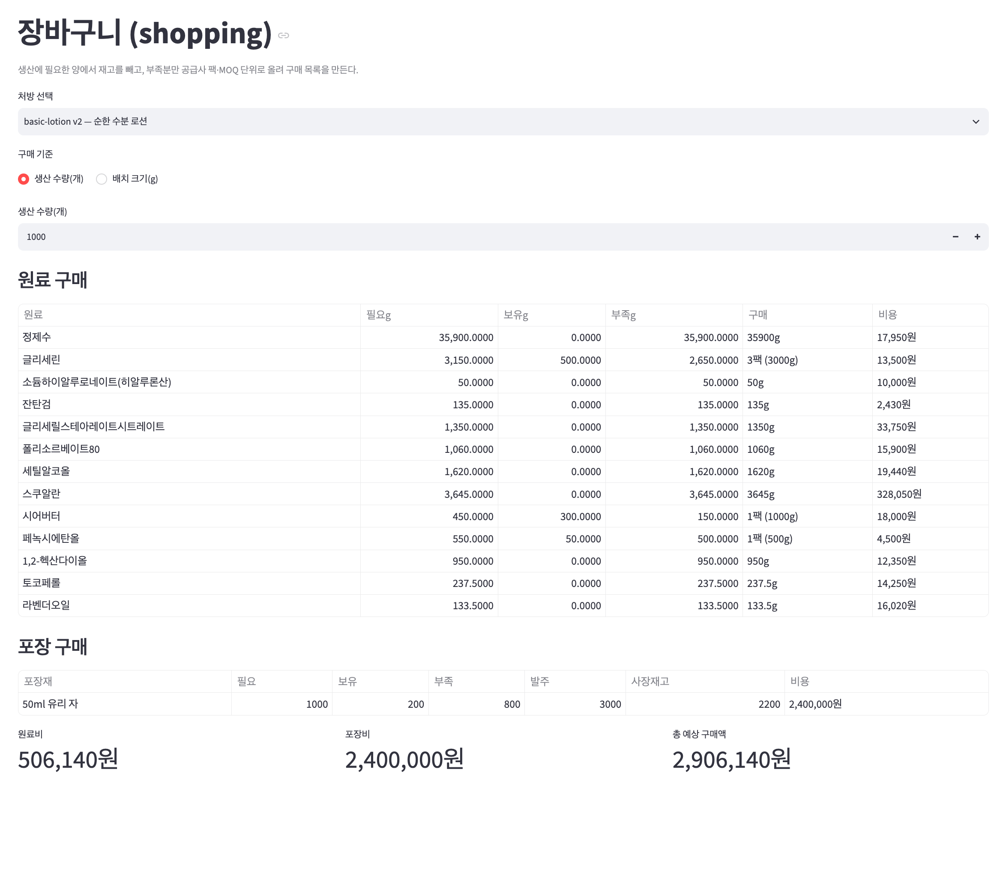

> 💡 **결정:** 비용 대부분이 **용기 MOQ(3,000개)** — 1,000개만 필요한데 3,000개 사야 해 **2,000개 사장 재고**. **병목은 처방이 아니라 포장.** → 용기 업체 재검토 or 초도 물량 상향 저울질.

## 7-3. `자금 6:4` 페이지 🏦

| 칸 | 넣을 값 |
|---|---|
| `총 자본(원)` | `10000000` |
| `제품 목표 비중`(슬라이더) | `0.6` |
| `월 소진(원)` | `800000` |
| 지출 표(category/amount) | 제품 3,600,000 / 마케팅 1,200,000 / 기타 100,000 |

▶️ **[💾 자금 저장]** → **제품 75% : 마케팅 25%** (목표 60:40) → **"제품 편중 — 마케팅 투자 부족" 경고**, 런웨이 **6.4개월**.

> 📸 **캡처 S7-3** · 자금 6:4 — **실제 배분(제품 75:마케팅 25) + 편중 경고 + 런웨이 6.4개월**이 보이게. → `img/산뜻보습로션/S7-3_자금64.png`

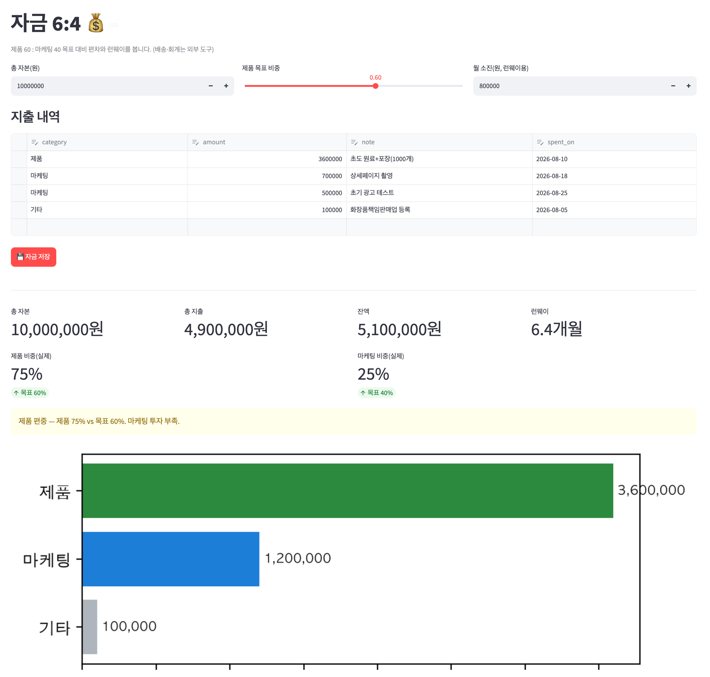

> 💡 **결정:** 제품만 잘 만들고 안 알리면 안 팔린다. 다음 지출은 **마케팅 쪽으로** 기울여 6:4에 맞춘다. 런웨이 6.4개월 안에 손익분기(302개) 돌파가 목표.

---

# STEP 8 · 문서 — 공장·기관 제출용

## `제품표준서` 페이지 📄
`처방 선택`=daily-lotion v2, `원가 요약 포함` 체크, `원가 기준 수량`=1000 → **[제품표준서 내려받기(.md)]**.

> 📸 **캡처 S8-1** · 제품표준서 **미리보기 화면**(처방·전성분·제조·규제·원가 섹션이 한 문서로 이어진 모습) + 내려받기 버튼. → `img/산뜻보습로션/S8-1_제품표준서.png`

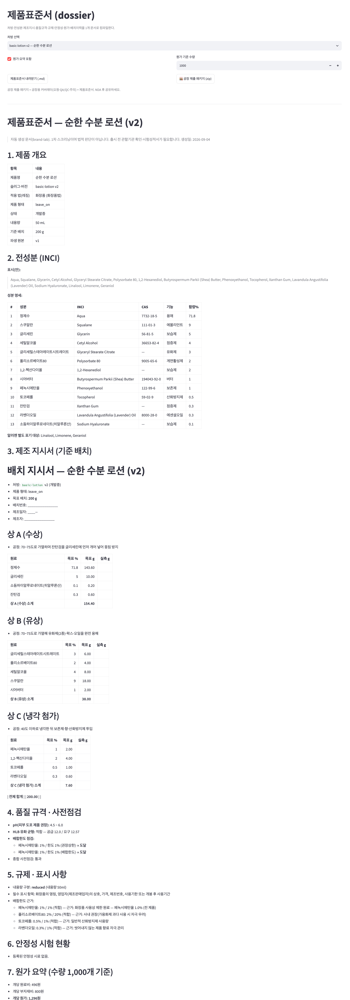

> 💡 **결정:** 처방·전성분·제조·규제·원가를 **한 문서**로. OEM 위탁 시 그대로 제출.

---

# STEP 9 · 디자인 — 패키지·라벨 (규격 먼저)

> 🧭 **순서 주의:** 패키지·라벨은 **제품 규격을 먼저 봐야** 한다 — 내용량(50mL)·용기 규격(용량·재질)·라벨 **법정 필수기재**. 이 규격들은 STEP 2(포장재)·3(처방)·6(라벨)·7(용기 확정, MOQ)에서 정해지고, **디자인 브리프가 그걸 자동으로 모아준다.** 그래서 디자인 브리프가 곧 "규격을 먼저 본" 단계이고, 규격이 확정된 **뒤(STEP 9)** 에 온다.

## `디자인 브리프` 페이지 🎨

`처방 선택`=daily-lotion v2 → **[디자인 브리프 내려받기(.md)]**. 브리프에 자동 포함:
- **규격** — 내용량·용기 규격(용량·재질)
- **규제** — 라벨 법정 필수기재 체크리스트 + 전성분 표시(안)
- **톤** — 기획의 페르소나·문제 + 브랜드 비주얼(컬러·사진 톤·금지어)

브리프 하단 **§6에 "패키지·라벨 아트 프롬프트"가 자동 생성**됩니다(규격·컬러·톤·필수기재 여백·금지어 반영). 이걸 복사해 **① 이미지 생성 → ② 일러스트레이터(벡터·인쇄)** 로 패키지/라벨을 만든다.

> 📸 **캡처 S9-1** · 디자인 브리프 화면 — **규격·규제(필수기재)·톤** 요약 + 하단 **§6 아트 프롬프트**가 보이게. → `img/산뜻보습로션/S9-1_디자인브리프.png`

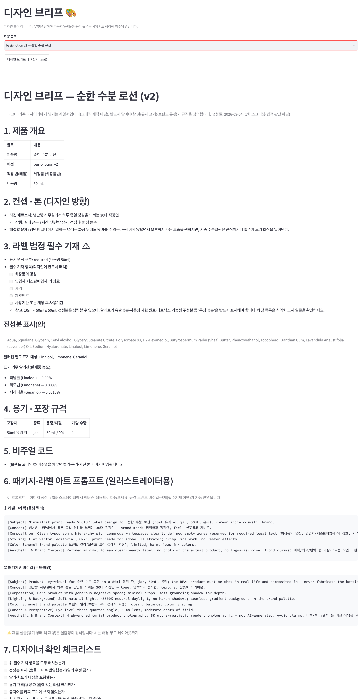

> 💡 **결정:** 상세페이지(STEP 10)와 **원리는 같다**(프롬프트→이미지→편집툴). 도구·목적만 다르다.
> - **패키지·라벨** = 규격·인쇄 중심 → **일러스트레이터(벡터)**
> - **상세페이지** = 화면·마케팅 중심 → **피그마**
>
> 규격을 확정하지 않고 디자인부터 하면 **라벨 필수기재 누락·용기 안 맞음** 등 재작업이 난다. 그래서 규격(브리프)이 먼저.

---

# STEP 10 · 마케팅·등록

> 🧭 **순서 주의(중요):** 상세페이지를 만들려면 **이미지가 먼저** 필요하다. 그래서 흐름은
> **① 이미지 프롬프트(소재) → ② 이미지 생성 → ③ 피그마 상세페이지 → ④ 상품 등록(리스팅)**.
> 그래서 **상품 등록은 이미지 프롬프트 뒤**에 온다.

## `개발 서사` 페이지 🎬
v1→v2 개선·배치·실험 기록이 **타임라인·콘텐츠 소재**로("묽음 잡으려 잔탄검 올린 이야기" = 비하인드).

> 📸 **캡처 S10-1** · 개발 서사 **타임라인**(v1→v2 사건들) + 콘텐츠 소재 목록이 보이게. → `img/산뜻보습로션/S10-1_개발서사.png`

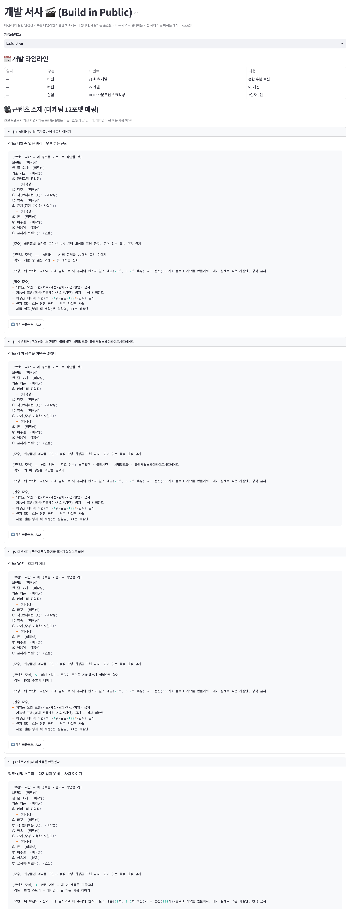

## `이미지 프롬프트` 페이지 🖼️
제품·브랜드 톤(브랜드 코어 ⑦ 비주얼)으로 상세페이지·SNS용 **이미지 생성 프롬프트**를 만든다 → 그 프롬프트로 이미지 생성 → **피그마에서 상세페이지 제작**.

> 📸 **캡처 S10-2** · 자동 생성된 **이미지 프롬프트 텍스트**(6블록) + 실촬영 안내가 보이게. → `img/산뜻보습로션/S10-2_이미지프롬프트.png`

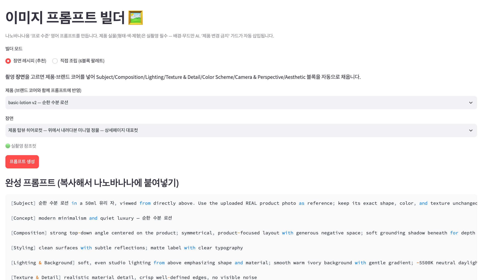

> 💡 **결정:** 브랜드 코어의 컬러·사진 톤·금지어가 프롬프트에 반영돼 **일관된 비주얼**. 실사가 필요한 부분은 실촬영 안내가 붙는다.

## `상품 등록` 페이지 📝
위에서 만든 **상세페이지가 완성된 뒤** 리스팅 자료 생성 → 규제 검수 게이트 통과 → 스마트스토어 등에 등록.

> 📸 **캡처 S10-3** · 상품 등록 자료 + **규제 검수 게이트 ✅ 통과** 표시가 보이게. → `img/산뜻보습로션/S10-3_상품등록.png`

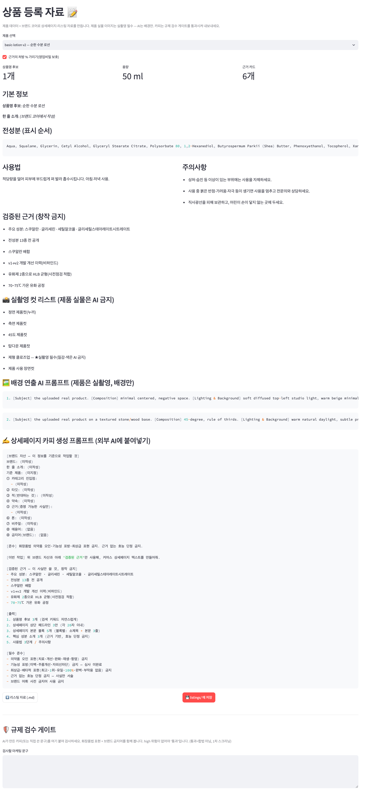

> 💡 **결정:** 등록은 이미지·상세페이지가 준비된 **뒤**. 이미지 프롬프트(소재)가 상품 등록의 선행이라 순서가 이렇게 된다.

## `고객 접점 · 후기` 페이지 💬

`제품 선택`=오후 산뜻 보습 로션 → 탭별로:
- **동봉 카드** 탭: 문구 자동 생성 → 아래 **규제 게이트 ✅ 통과** 확인
- **후기 요청** 탭: `대가성(협찬·원고료)` 체크하면 **뒷광고 표기 문구 자동 첨부**
- **재구매 시나리오** 탭: **D+3 / 14 / 40 / 70** 메시지
- **후기 → 증거** 탭: ★4↑·구매확인 후기가 **근거 카드로 승격**

> 📸 **캡처 S10-4** · **후기 요청** 탭에서 `대가성` 체크 시 **뒷광고 표기 문구가 자동 첨부**된 화면(강제되는 모습). → `img/산뜻보습로션/S10-4_고객접점_뒷광고.png`

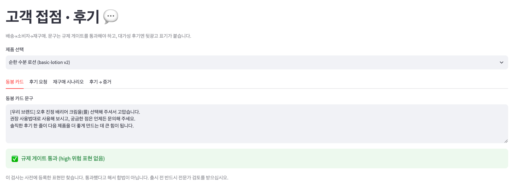

> 💡 **결정:** 협찬 후기엔 반드시 "협찬" 표기 — **시스템이 강제**하므로 실수 없음.

---

# STEP 11 · 출시 준비

## `인증·시험 추적` 페이지 ✅
화장품 관문 체크리스트: 책임판매업 등록 · CGMP 제조사 위탁 · **방부력(챌린지) 시험** · 원료 CoA · 표시기재 검수 — 상태(대기/진행/완료)·기한 관리. 홈 화면이 밀린 관문을 알림.

> 📸 **캡처 S11-1** · 인증·시험 관문 목록 — **진행률 + 각 관문 상태(대기/진행/완료)·기한**이 보이게. → `img/산뜻보습로션/S11-1_인증추적.png`

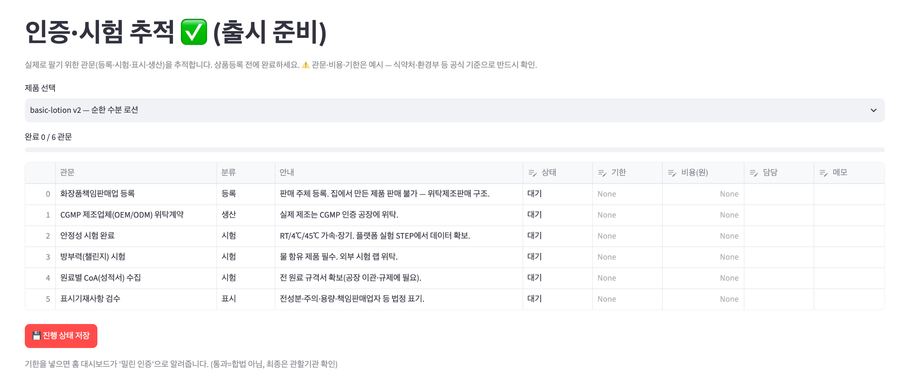

> 💡 **결정:** 물 든 제품은 **미생물이 최대 리스크** → 방부력 시험 성적서 없이는 출시 금지.

---

# 되먹임(Loop) — 출시가 끝이 아니다
근거(⑤)는 **두 번** 채워진다:

1. **출시 전 — 관능·패널**(STEP 5): "산뜻함 평균 4.5/5 (타깃 8명 관능)" → 포지셔닝의 **첫 근거**. 동시에 약점(촉촉함)은 **v3 개선 과제**로 되먹임.
2. **출시 후 — 후기**(STEP 10): 
   > "오후에도 당기지 않고 화장 위에 덧발라도 밀리지 않아요." (★5, 실사용 후기)

이 둘을 **[브랜드 코어] ⑤ 근거**에 붙이면 → 포지셔닝·마케팅이 **새 증거로 더 강해진다.** 자금도 6:4 편차를 보며 계속 조정.

> 🎓 **핵심 루프:** 기획→개발→**검증·관능(출시 전 근거)**→판매→**후기(출시 후 근거)**→기획·포지셔닝 강화.
> 관능의 **약점**은 곧 다음 버전의 **개선 과제** — MOQ 쓰기 전에 방향을 고친다.

---

# 한눈 요약 — 이 제품에서 내린 결정과 이유

| STEP | 결정 | 이유(숫자/원칙) |
|---|---|---|
| 기획 | "오후 당김"을 1순위 | 페인 점수 **20**(최고) |
| 기획 | 문제=끈적임(덧바름 불가) | 대안 불만 분석 → 방향 전환 |
| 원료 | 글리세린 증량 대신 **판테놀** | 다축 = 차별+성능, 원가 **+23원**뿐 |
| 사전점검 | 유상 안 건드림 | HLB 균형 유지(층분리 방지) |
| 검증 | v2 확정 | diff 개당 +23원 = 리스크 없음 |
| 관능(패널) | **MOQ 전 게이트 통과** | 타깃 **산뜻함 4.5** 검증(USP)·촉촉함 3.75는 약점(v3 과제) |
| 원가 | 판매가 **22,000원** | 마진 45.3%·손익분기 302개 |
| 구매 | 용기 업체 재검토 | 병목=포장 MOQ(사장재고 2,000) |
| 자금 | 마케팅 비중↑ | 제품 75% 편중 경고·런웨이 6.4개월 |
| 디자인 | 사양서로 넘김 | 기획→브리프 자동 반영, 재작업↓ |
| 마케팅 | 협찬 뒷광고 표기 | 게이트가 강제 |
| 출시 | 방부력 시험 필수 | 물 제품 최대 리스크 |

> 이 시나리오의 데이터(페르소나·문제·후기·예산·처방 v1/v2)는 저장소에 포함되어, 각 페이지를 지금 열면 동일한 값이 나옵니다.
> 화면 기본 사용법은 [`UI_사용_가이드.md`](UI_사용_가이드.md)를 먼저 보세요.

---

# 부록 A · 캡처 체크리스트

찍어서 **`docs/img/산뜻보습로션/`** 에 아래 **파일명 그대로** 넣으면 본문 이미지가 자동으로 채워집니다. 다 채우면 이 문서만으로 화면 없이도 전 과정을 따라갈 수 있습니다.

| ☐ | 코드 | 페이지 / 순간 | 파일명 |
|---|---|---|---|
| ☐ | **H-1** | 홈 — 사이드바 + 📍오늘 퀘스트 + 🔔오늘 할 일 + 현황·마일스톤 | `H-1_홈대시보드.png` |
| ☐ | **H-2** | 오늘·진행 — D+·스트릭 + 전체 지도 퀘스트 체크리스트 | `H-2_오늘진행.png` |
| ☐ | **S0-1** | 페르소나·JTBD — 입력 표(저장 전) | `S0-1_페르소나입력.png` |
| ☐ | **S0-2** | 페르소나·JTBD — 🔥 페인 우선순위(저장·F5 후) | `S0-2_페인우선순위.png` |
| ☐ | **S0-3** | 시장·경쟁 조사 — 경쟁 표 + gaps | `S0-3_경쟁조사.png` |
| ☐ | **S0-4** | 문제 정의 — 자동 초안 + 하류 프리필 | `S0-4_문제정의.png` |
| ☐ | **S0-5** | 포지셔닝 — 자동 조립 문장 | `S0-5_포지셔닝문장.png` |
| ☐ | **S0-6** | 브랜드 코어 — 9칸 시트(⑦컬러 포함) | `S0-6_브랜드코어.png` |
| ☐ | **S0-7** | 브랜딩 느낌 미리보기 — 컬러 스와치·팔레트 띠 | `S0-7_컬러스와치.png` |
| ☐ | **S0-8** | 브랜딩 느낌 미리보기 — 무드보드 프롬프트 | `S0-8_무드보드프롬프트.png` |
| ☐ | **S1-1** | 규제판정 — 화장품/적합 OK | `S1-1_규제판정.png` |
| ☐ | **S2-1** | 원료 — PubChem 자동채움 결과 | `S2-1_원료_PubChem.png` |
| ☐ | **S2-2** | 원료 도감 — 백과 + 계산용 데이터 한 화면 | `S2-2_원료도감.png` |
| ☐ | **S2-3** | 포장재 — 등록 폼(jar-50ml·MOQ 3000) | `S2-3_포장재등록.png` |
| ☐ | **S2-4** | 재고 — 만료/임박/신선 상태 | `S2-4_재고상태.png` |
| ☐ | **S3-1** | 처방 — 상(A/B/C)·원료·% 표 | `S3-1_처방구성.png` |
| ☐ | **S3-2** | 사전점검 — 5중 점검(HLB·한도·충돌·보존·유수분) | `S3-2_사전점검.png` |
| ☐ | **S4-1** | 배치기록 — 요약(수율·pH) | `S4-1_배치요약.png` |
| ☐ | **S5-1** | 버전비교 — 판테놀·+23.5원 | `S5-1_버전비교.png` |
| ☐ | **S5-2** | 관능·패널 — 응답 입력 표 | `S5-2_관능응답입력.png` |
| ☐ | **S5-3** | 관능·패널 — 요약·약점·근거 승격 | `S5-3_관능요약근거.png` |
| ☐ | **S5-4** | 실험·DOE — 주효과 표 + 🎯 추천 조합 | `S5-4_DOE주효과.png` |
| ☐ | **S5-5** | 실험·안정성 — 밀린 관찰 + 조건별 현황 | `S5-5_안정성현황.png` |
| ☐ | **S6-1** | 라벨 — 전성분·알러젠 | `S6-1_라벨_전성분.png` |
| ☐ | **S6-2** | 문구검사 — 위험 표현 색 표시 | `S6-2_문구검사.png` |
| ☐ | **S7-1** | 원가 — 원가·마진·손익분기 | `S7-1_원가.png` |
| ☐ | **S7-2** | 장바구니 — 총액(원료 vs 포장) | `S7-2_장바구니.png` |
| ☐ | **S7-3** | 자금 6:4 — 배분·경고·런웨이 | `S7-3_자금64.png` |
| ☐ | **S8-1** | 제품표준서 — 미리보기 | `S8-1_제품표준서.png` |
| ☐ | **S9-1** | 디자인 브리프 — 규격·톤·§6 프롬프트 | `S9-1_디자인브리프.png` |
| ☐ | **S10-1** | 개발 서사 — 타임라인 | `S10-1_개발서사.png` |
| ☐ | **S10-2** | 이미지 프롬프트 — 6블록 | `S10-2_이미지프롬프트.png` |
| ☐ | **S10-3** | 상품 등록 — 게이트 ✅ 통과 | `S10-3_상품등록.png` |
| ☐ | **S10-4** | 고객 접점 — 뒷광고 표기 자동 첨부 | `S10-4_고객접점_뒷광고.png` |
| ☐ | **S11-1** | 인증·시험 추적 — 진행률·상태 | `S11-1_인증추적.png` |

**캡처 팁**
- Windows 부분 캡처: `Win + Shift + S` → 영역 지정 → 붙여넣기 저장. 파일명은 위 표 그대로.
- 가로가 긴 표는 브라우저 폭을 넓혀(또는 `Ctrl + -` 로 축소) 한 화면에 담기게.
- 결과가 안 뜨면 대개 **저장 후 F5**를 안 한 것 — 새로고침 후 다시 확인하세요.
